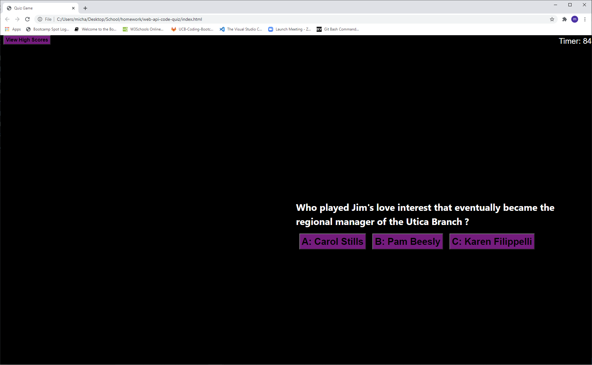

# Web API Quiz Game - The Office Edition

## Summary
A student wanted a timed quiz to store high scores to gauge knowledge against his peers. The original request was for a 
quiz for coding but it wasn't a required ask. The student who requested this proeject was a big fan of The Office and wanted
a way to test himself against his peers with the series leaving Netflix at the end of 2020. 
<br>
<br>

## Site Picture



<br>
<br>

## What Was Done
The code was made to be dynamic from the opening screen to the timer starting alongside the questions. The web api quiz was 
made to change content while keeping track of the users score with remaining time following the end of the quiz. Each user 
can store their high scores while all high scores will be stored in local storage for the window. 
<br>
<br>

## Code Snippet
```javascript
function questionNumber() {
    var pEl = document.createElement("p");
    pEl.textContent = quizQuestions[questionId].question;
    questionsEl.appendChild(pEl);
    for (var i = 0; i < quizQuestions[questionId].answers.length; i++) {
        var button = document.createElement("button");
        button.textContent = quizQuestions[questionId].answers[i];
        button.setAttribute("value", quizQuestions[questionId].answers[i]);
        questionsEl.appendChild(button);
        button.addEventListener("click", function () {
            if (this.value === quizQuestions[questionId].correctAnswer) {
                alert("That's Correct");
                questionsEl.innerHTML = "";
                questionId++;
                if (questionId < 5) {
                    questionNumber();
                } else {
                    showScore();

                }
            } else {
                secondsLeft = secondsLeft - 10;
                timeEl.textContent = "Timer: " + secondsLeft;
                alert("You're wrong!");
                questionsEl.innerHTML = "";
                questionId++;
                if (questionId < 5) {
                    questionNumber();
                } else {
                    showScore();
                }
            }
        })
    };
}
```
This snippet of the code is what would be considered the engine that makes the code quiz function correctly.
The function questionNumber prints each question and answer dynamically to the page. It runs throughout the 
length of the quiz (5 questions) while deducting time for any incorrect answers and after the 5th question
brings users to a form page to save their high score within local storage. 
<br>
<br>

## Built With

* [HTML](https://developer.mozilla.org/en-US/docs/Web/HTML)
* [CSS](https://developer.mozilla.org/en-US/docs/Web/CSS)
* [Javascript](https://developer.mozilla.org/en-US/docs/Web/JavaScript)
* [BootStrap](https://getbootstrap.com/)

<br>
<br>

## Deployed Link

[Live Link "The Office Code Quiz"](https://michaelanthonyyy.github.io/web-api-code-quiz/)

<br>

## Authors

**Michael Medina** 
- [Link to Github](https://github.com/michaelanthonyyy)
- [Link to LinkedIn](https://www.linkedin.com/in/michael-medina-22aa70200?lipi=urn%3Ali%3Apage%3Ad_flagship3_profile_view_base_contact_details%3B311BosSLTMS4JkhAfkX61A%3D%3D)
